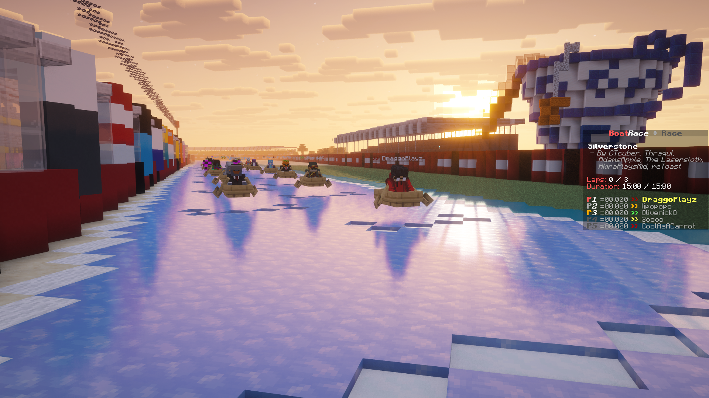
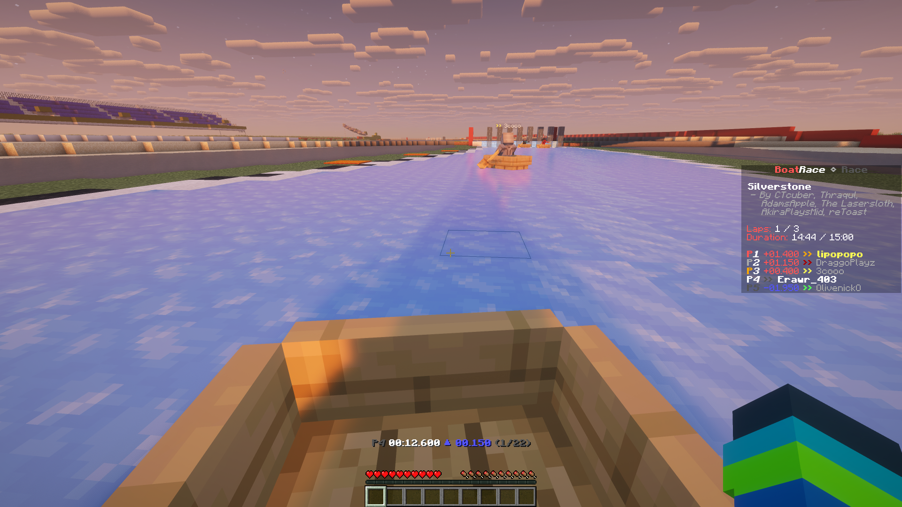

# Open Boat Racing

A configurable, open-source server-side minecraft minigame mod built using the [Nucleoid](https://nucleoid.xyz/) project!

This mod comes with 3 different game modes:

- TimeTrial: Compare personal bests against other players.
- Qualifying: Set a best lap time to qualify for a grid position.
- Race: "The only place that matters is first." - _Max Verstappen_

With support for teams, pit-stops, [OpenBoatUtils](https://modrinth.com/mod/openboatutils)¹, strange lightning rods, and more!

Join the [Mumbo Jumbo](https://discord.gg/yPafK59A8b) discord server where we occationally run events with this among other mods within the Nucleoid project :3

<div align="center">
  
  
  <br/>
  <em><a href="https://www.planetminecraft.com/project/f1-silverstone-british-gp-1-1-scale-ice-boat-racing-track/">F1 Silverstone, British GP, 1:1 scale Ice boat racing track by FC1 (2022)</a></em>
</div>

## Usage

Use `/game open boatrace:example` to get started! The mod does not include any maps. You will have to create maps or join a server (like [ours!](<(https://discord.gg/yPafK59A8b)>)) that already have maps for this mod.

## Mapping

You will need [Nucleoid Creator Tools](https://modrinth.com/mod/nucleoid-creator-tools) to create a map, you can follow their tutorial [here](https://docs.nucleoid.xyz/plasmid/maps/) to get started. Open Boat Racing uses the following regions with the following nbt in `/map region` (Region) and additional data nbt with `/map data` (Data).

<details>
<summary>(Region) `checkpoint` and `grid_box`</summary>

```json5
{
    "index": [Int],
    "yaw": [Float], // default: 0
    "pitch": [Float], // default: 0
}
```

</details>

<details>
<summary>(Region) `spawn` and `pit_lane`</summary>

```json5
{
    "yaw": [Float], // default: 0
    "pitch": [Float], // default: 0
}
```

</details>

<details>
<summary>(Data) `track_format`</summary>

```json5
2 // this must be a constant and included with every map.
```

</details>

<details>

<summary>(Data) `meta`</summary>

```json5
{
    "name": [String], // default: Unknown Name
    "authors": [List[String]], // default: Unknown Authors
    "description": [String], // Optional
    "url": [String], // Optional
}
```

</details>

<details>
<summary>(Data) `attributes`</summary>

```json5
{
    "time_of_day": [String],
    "layout": ["circular" | "linear"] // default: "circular"
}
```

</details>

<details>
<summary>(Data) `openboatutils`</summary>
TODO document me
https://github.com/Abaan404/boatrace/blob/3508adb0c3d3d0266115a162424e49f5bbd58c6c/src/main/java/com/abaan404/boatrace/compat/openboatutils/OBUTrackConfig.java
</details>

## Config

To choose a specific game mode, you must omit or include these fields accordingly:

- TimeTrial: exclude `qualifying` and `race`.
- Qualifying/Race: include `qualifying` and `race`.
- Race: exclude `qualifying` but include `race`.
- OpenBoatUtils (experimental): adding this field makes the game require OpenBoatUtils, anyone who doesnt have the client mod will be forced into spectator.

<details>
<summary>config</summary>

```json5
{
    "type": "boatrace:game",
    "track": [Identifier],
    "team": {
        "size": [Int] // default: 1
    },
    "qualifying": {
        "duration": [Long], // in ms
        "laps": [Int] // optional
    },
    "race": {
        "max_duration": [Long], // in ms
        "max_laps": [Int], // default 1
        "no_respawn": [Bool], // default: false
        "accept_unqualified": [Bool], // default false
        "pits": {
            "success": {
                "duration": [Long], // default 2000ms
                "random": [Long] // default 3000ms
            }
            "failure": {
                "duration": [Long], // default 2000ms
                "random": [Long] // default 0ms
            }
            "count": [Int] // default 0
        }
        "grid_type": ["normal" | "reversed" | "random"], // default "normal"
        "go_countdown": {
            "duration": [Long], // default 5000ms
            "random": [Long] // default 2000ms
        }
        "scoring": [List[Int]], // default: [10, 9, 8, 7, 6, 5, 4, 3, 2, 1]
    },
    "openboatutils": {
        "filter": [List[String]],
        "collision": ["vanilla" | "no_collision_with_any_entities" | "filtered_collision" | "no_collision_with_boats_and_players_plus_filtered_collision"],
        "resolution": [Byte],
    }
}
```

</details>

¹ OpenBoatUtils support is experimental and is seperately marked with +OBU, additional game configs will be required to setup the client.
